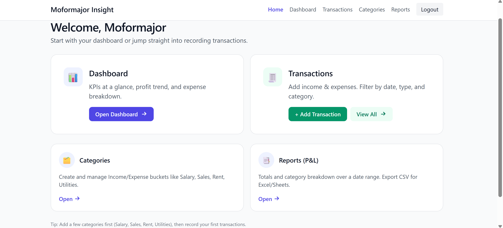
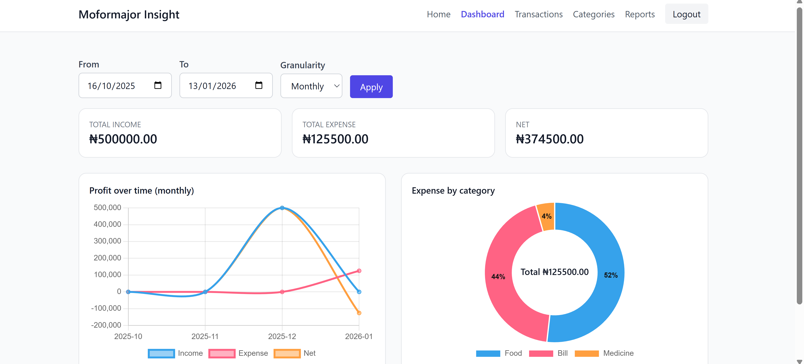
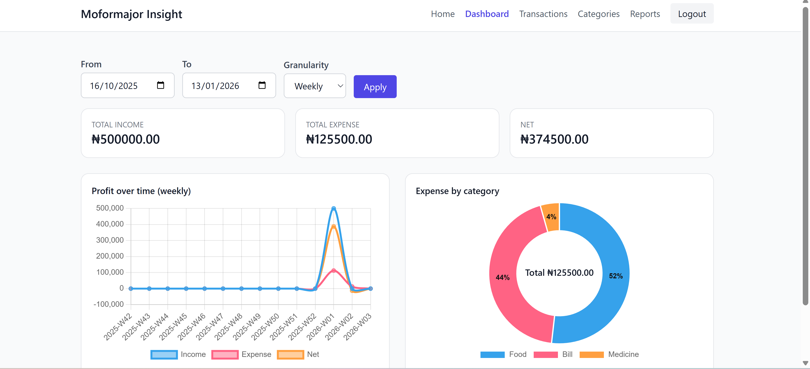

# 💰 Money Tracker (mo4_tracker)

A **Django-based personal finance tracker** that allows users to manage income and expenses, organise categories, view dashboards and reports, and export financial data — with full user authentication and per-user data isolation.

**Live deployment:** PythonAnywhere  
**Database:** MySQL  


---

## ✨ Features

### 🔐 Authentication & Accounts
- User signup, login, and logout
- Per-user data isolation
- Automatic user profile creation
- User-selectable currency (GBP, USD, EUR, NGN, etc.)

### 🏷️ Categories
- Create, edit, delete **Income** and **Expense** categories
- Categories are unique per user
- Protected deletion (categories with transactions cannot be deleted)

### 💳 Transactions
- Full CRUD (Create, Read, Update, Delete)
- Assign transactions to categories
- Supports **“Other…”** category creation on the fly
- Advanced filtering:
  - Type (Income / Expense / Both)
  - Category
  - Date range
  - Free-text search
- KPI totals calculated on the **filtered dataset**
- Pagination for large datasets

### 📊 Dashboard
- Weekly-first dashboard (optional monthly view)
- KPIs:
  - Total Income
  - Total Expense
  - Net balance
- Line chart:
  - Income / Expense / Net over time
- Donut chart:
  - Expense breakdown by category
- Densified timelines (no gaps in charts)





### 📑 Reports
- Profit & Loss report for any selected date range
- Income and Expense breakdown by category
- CSV export for offline analysis or spreadsheets

### 💱 Currency Support
- User-selectable currency
- Automatic symbol mapping (£, $, €, ₦, etc.)
- Safe fallback if a user profile is missing

---

## 🧱 Project Structure

```text
money_tracker/
├── manage.py
├── mo4_tracker/
│   ├── settings.py
│   ├── urls.py
│   ├── wsgi.py
│   └── asgi.py
├── finance/
│   ├── models.py
│   ├── views.py
│   ├── forms.py
│   └── templates/
├── accounts/
│   ├── models.py
│   ├── views.py
│   ├── forms.py
│   └── templates/
├── templates/
├── staticfiles/
└── venv/

---

## ⚙️ Tech Stack

- **Python 3.11**
- **Django 5.2.6**
- **MySQL**
- **Chart.js**
- **PythonAnywhere**
- **Class-Based Views (CBVs)**

---

## 🚀 Deployment (PythonAnywhere)

Key production settings:

```python
DEBUG = False
ALLOWED_HOSTS = ["mtracker.pythonanywhere.com"]
CSRF_TRUSTED_ORIGINS = ["https://mtracker.pythonanywhere.com"]

STATIC_URL = "/static/"
STATIC_ROOT = BASE_DIR / "staticfiles"
